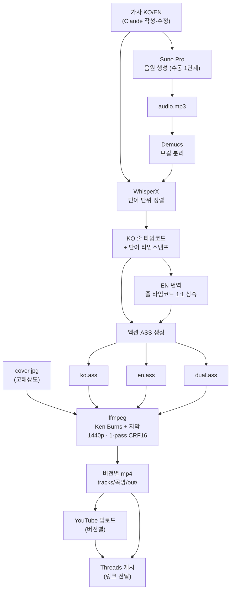

# HADES — 프로젝트 헌장 & 아키텍처

> 이 프로젝트의 **최상위 문서**. 모든 기획·실행은 이 안에서 진행한다.
>
> | 문서 | 역할 |
> |---|---|
> | **HADES.md** (이 문서) | 헌장(정의) · 운영원칙 · 아키텍처 — *왜 / 무엇을* |
> | PLAN.md | 실행 계획 · 마일스톤 · 체크리스트 — *언제 / 어떤 순서로* |
> | README.md | 설치 · 실행 가이드 — *어떻게 돌리는가* |

---

## 1. 하데스 정의 (헌장)

1. 가사를 쓰면 **수정·코드형 편곡·작품화**까지 일괄 처리한다.
2. 가사는 **한글·영어 양버전**으로 발행할 수 있게 만든다.
3. 영상의 **자막 액션은 가사와 최대한 정확히 싱크**되게 한다.
4. 완성 음악은 **YouTube·Threads·기타 연결 매체로 자동 업로드**할 수 있게 한다.
5. 음악을 **개별 파일로 저장**할 수 있게 한다.
6. **영상 퀄리티는 최상**으로 만들 수 있어야 한다.
7. 모든 결정은 **작은 추측이 아니라 서치를 통해 조율**해서 만든다.

---

## 2. 운영 원칙 (Operating Principles)

### 2.1 역할 모델 — 네비게이터(Claude) ↔ 실행자(Code)

**네비게이션은 항상 Claude가, 실행은 항상 코드가 한다.**


- **Claude(네비게이터)** 의 몫: 모든 *판단과 선택* — 리서치, 가사/편곡/작품화, 품질·기준 결정, 단계 조율, 다음 행동 결정. 흐트러짐 없이 **항상 최상의 컨디션**으로 일관된 판단·기준·문체(존댓말)·품질을 유지한다.
- **Code(실행자)** 의 몫: 결정된 것을 *그대로 반복·연산·IO* — 추측하지 않는다. 모호하면 멈추고 네비게이터에게 돌린다.
- **경계 규칙:** "판단/선택"은 전부 Claude, "반복/연산/입출력"은 전부 Code.

### 2.2 리서치 우선 (정의 §7)
모든 결정은 추측이 아닌 **서치로 조율**한다. 새 요구·불확실한 사실·외부 도구 동작은 먼저 검증한 뒤 코드/계획에 반영한다.

### 2.3 이전 대화의 세세한 기억 — **필수**
Claude는 매 세션 시작 시 **이 프로젝트의 이전 대화를 세세히 상기**한다.
- 메모리에 더해, 다음이 불확실하면 **'없음'으로 단정하지 말고 과거 대화를 먼저 검색**(conversation_search / recent_chats)해 확인한 뒤 진행한다.
- 빠짐없이 유지할 것: **(a)** 진행 중·완료 곡과 그 결정들, **(b)** 하데스 정의와 모든 기술 표준, **(c)** 미결정 항목(제목·포맷·발행 모드 등), **(d)** 사용자 선호 — 존댓말, 간결·직접 소통, *장소=감정 은유*, 직접 진술 대신 감각·동작으로 표현, Suno 영어 섹션 태그, 수미상관 등.

### 2.4 최상 컨디션 의무
네비게이터로서 일관성·정확성·품질을 매 턴 유지한다. 같은 기준을 두 번 묻지 않고, 확정된 것은 흔들지 않으며, 사용자는 짧은 말로 방향만 줘도 전체 패키지가 정확히 나오도록 한다.

### 2.5 창작 표준 (Aesthetic Constitution)
이 프로젝트의 정체성이자 'AI 슬롭'과 구별되는 전략적 해자. **가사·작품화의 판단 기준(§1)이다.**
- **간접 표현:** 감정을 직접 말하지 않는다. 감각·물성·동작·함의로 드러낸다. ("슬프다" ✗ → 식어가는 종이컵·차가운 난간 ○)
- **장소=감정 은유:** 서울/인천의 구체적 장소(올림픽대로·옥련동·송도유원지·올림픽공원·구읍뱃터·월미도 등)를 정서의 닻이자 은유로 쓴다.
- **수미상관:** 첫 이미지를 말미에 되울려 원형 구조로 닫는다.
- **장르 지정:** 레퍼런스 아티스트/스타일로 정확히 호명(예: Peaches 레인, 록 발라드)하면 즉시 적용한다.
- **Suno 공정:** 영어 섹션 태그·영어 애드립이 한국어 렌더링·발음에 유리. 코드 직접 입력 불가(코드차트는 편곡 참고용).
- **차별화 의무:** 곡마다 장소·정서·사운드를 달리해 양산형으로 보이지 않게 한다(수익화 방어와 직결).

### 2.6 범위 규율 — 한 곡 먼저 완주
기능을 넓히기 전에 **첫 곡을 끝까지(생성→자막→영상→업로드) 완주**해 파이프라인을 검증한다. 그 뒤 일반화·추가 매체·천장 기능을 더한다. (과설계 방지)

---

## 3. 시스템 아키텍처

### 3.1 상위 데이터 플로우



### 3.2 모듈 책임표

| 모듈 | 책임 | 입력 | 출력 | 구분 |
|---|---|---|---|---|
| `pipeline.py` | 단계 오케스트레이션 · context 전달 · 선행단계 보장 | `config.yaml`, `--steps` | 단계 호출 | 실행 |
| `align.py` | 보컬분리 · 정렬 · EN 타임코드 상속 · 버전별 ASS/LRC | audio, lyrics_ko, lyrics_en | `{ver: ass}`, lrc | 실행 |
| `make_video.py` | Ken Burns + 자막 굽기 + 2-pass 최상화질 인코딩 | cover, audio, `{ver: ass}` | `{ver: mp4}` | 실행 |
| `upload_youtube.py` | 버전별 업로드(언어 태그 제목) · 토큰 관리 | `{ver: mp4}`, youtube cfg | `{ver: url}` | 실행 |
| `post_threads.py` | Threads 게시(텍스트+링크 / 네이티브 영상) · 토큰 갱신 | url, threads cfg | post id | 실행 |
| `config.yaml` | 모든 파라미터(곡별 복사) | — | — | 네비게이터가 설정 |
| **Claude** | 가사·작품화·기준·조율·리서치·결정 | — | 결정·파라미터 | **네비게이터** |

### 3.3 단계별 입·출력 (context 전달)

```
align  : audio + lyrics(KO/EN) ──▶ ass_map {ver: ass}, *.lrc
video  : cover + audio + ass_map ──▶ video_map {ver: mp4}
upload : video_map ──▶ youtube_urls {ver: url}
threads: youtube_urls ──▶ Threads post
```
각 단계는 단독 실행 가능하며, 선행 산출물이 없으면 `pipeline.py`가 자동으로 앞 단계를 보장한다.

---

## 4. 서브시스템 아키텍처

### 4.1 자막 싱크 (정의 §3)
- 가사를 이미 보유하므로 STT가 아닌 **forced alignment**. 음원은 한국어 보컬 → **KO를 음원에 정렬**.
- WhisperX 단어 타임스탬프 ↔ 실제 가사를 difflib로 정렬해 줄별 (start, end) 산출. 인식이 빗나가도 **화면에는 항상 실제 가사**.
- 액션 자막: 줄 팝업 등장(`\fad`+`\t` 스케일) + 단어 색채움(`\kf`). libass 네이티브, ffmpeg 한 패스. (렌더 검증 완료)

### 4.2 한·영 양버전 (정의 §2)
- EN 번역은 KO 줄과 **1:1 타임코드 상속**(같은 줄 수 필수). 단어 타임스탬프가 없으므로 줄 길이에 균등 분할해 라인 단위 싱크.
- 발행 모드: `ko` / `en` / `dual`(KO 위 + EN 아래, **색 분리** 흰색/크림). 모드당 영상 1개.

### 4.3 최상 화질 (정의 §6) — 서치 확정
- **1440p(2560×1440)** 이상(1080p는 재인코딩 손실 구간). H.264 High · yuv420p · BT.709 · `+faststart`.
- **1-pass CRF 16**(정적 커버+자막 콘텐츠엔 2-pass와 화질 동등·시간 ½; 폴백 2-pass VBR 16~24 Mbps). 오디오 AAC-LC 48kHz 384k. 60fps. preset slow.

### 4.4 배포 (정의 §4)
- **발행 정책(실상):** 파이프라인 자동배선 금지(`youtube.enabled: false` 유지). 업로드는 **사용자가 `upload_scheduler.py`를 직접 실행**(대화형 OAuth 1회·일일캡·매니페스트 멱등)한다. 채널 계정 **reina2hj@gmail.com**은 사업계정 `foob0201@gmail.com`과 방화벽 분리(한 채널 정책위반의 전이 리스크 격리).
- **YouTube** Data API v3(무료, 하루 ~6건). 버전별 업로드.
- **Threads** 공식 API(무료, 본인 계정은 검수 불요). 텍스트+링크 / 공개 URL 시 네이티브 영상.
- **기타 연결 매체**: 확장 슬롯. 새 매체는 *서치 후* 모듈 추가(예: IG·X·Drive). 아키텍처상 업로더는 플러그인 형태로 추가 가능.

### 4.5 저장 (정의 §5)
```
tracks/<곡명>/
  ├── audio.mp3          # Suno 음원
  ├── lyrics_ko.txt      # 한글 가사(정렬 기준)
  ├── lyrics_en.txt      # 영어 가사(1:1)
  ├── cover.jpg          # 커버
  ├── config.yaml        # (선택) 곡별 설정
  └── out/               # 산출물: *_ko.mp4 / *_en.mp4 / *_dual.mp4, *.ass, *.lrc
```

---

## 5. 의사결정 로그 (네비게이터 최종)

| 항목 | 결정 | 비고 |
|---|---|---|
| 파이프라인 검증곡 | ✅ **완주 5곡**: 아무말도·봄날·동해로·거울속의오늘·**그렇게 지나간다** | 「관람차」는 음원 미생성으로 보류. 파이프라인은 5곡으로 엔드투엔드 검증됨 |
| 첫 공개 발행 | ✅ **「그렇게 지나간다」(geureoke)** — YouTube **public** (`oeWC8JtWDTs`, 2026-07-01) | dual, `upload_scheduler.py` 사용자 트리거 |
| 영상 포맷 | ✅ **가로 1440p** (최상화질 기준) | Shorts(세로)는 이후 보조 컷으로 |
| 발행 모드 | ✅ **dual** (KO+EN 1영상) | 완주 검증용. 이후 ko/en 분리 추가 가능 |
| 자막 액션 | ✅ action | |
| 화질 기준 | ✅ 1440p·1-pass CRF16·H.264 High | 서치 확정(폴백 2-pass VBR) |
| 한·영 정렬 | ✅ KO 음원정렬(MMS forced-align) + EN 1:1 상속 | 검증 완료 |

> 위 ✅는 네비게이터 권고 확정값이며, 선생님이 한마디로 덮어쓸 수 있다.

### 완료 기준 (Definition of Done) — 한 곡이 '완성'인 조건
1. KO 가사가 음원에 정렬되고 자막 싱크 육안 확인(필요 시 `offset_ms` 보정).
2. 선택 발행 버전 영상이 **최상 화질 프로파일**로 렌더됨.
3. 곡 폴더 `tracks/<곡>/`에 음원·KO/EN 가사·커버·산출물 보존.
4. YouTube 업로드 + (선택) Threads 게시, **매니페스트 기록**(중복 방지).
5. 메타데이터(제목·설명·가사·태그) 채워짐.

---

## 6. 벤치마크 & 보완 로드맵 (2026 서치 기준)

> 하데스 §7(추측이 아닌 서치)에 따른 최신 벤치마킹 결과. 우선순위대로 반영한다.

### 컴포넌트 벤치마크
| 영역 | 현재 | 2026 최신 | 판단 |
|---|---|---|---|
| 정렬 | WhisperX(transcribe→align) | MFA / NeMo NFA / torchaudio MMS forced_align | **가사 보유 → 알려진 텍스트에 직접 CTC forced-align이 더 정확·안정 (P1)** |
| 보컬분리 | htdemucs(default) | **htdemucs_ft**(동일비용·더 우수) / 천장: Mel·BS-RoFormer | ft로 즉시 교체 (P0), 최상은 RoFormer(선택) |
| 인코딩 | H.264 High·1440p·2-pass | AV1 60M(HW)·H.265 | 현 기준 충분, AV1은 천장(P3) |
| 자막 | ASS 액션(\kf+\fad+\t) | Remotion 단어 바운스 | 가사영상엔 ASS로 충분, 풀모션은 보류(P3) |

### 컴플라이언스 / 리스크
- **AI 공시:** 가사+추상 커버는 '현실 오인 합성 미디어'가 아니라 **일반적으로 YouTube 라벨 불필요**. 단 합성 보컬이 실존 인물처럼 들리면 대상. 공시 토글은 Studio 속성이라 Data API 미지원 가능 → 필요 시 수동.
- **수익화 핵심 리스크:** YouTube '비진정성(AI 슬롭)' 정책 + 자동 탐지(2026.5~). **방어 = 원작 가사 · 사람 큐레이션 · 곡마다 차별화**(이미 수행, 강점).
- **Meta:** C2PA 프로비넌스 자동 라벨 → 게시 측 별도작업 거의 불필요.
- **Content ID:** AI 음원 오탐 가능 → 원작 가사 보유가 방어.

### 엔지니어링 / 보안 갭 → 보완 로드맵 (범위 고정)
- **P0 — 지금 실행:** htdemucs_ft · 프리플라이트 검증(파일/폰트/ffmpeg/KO·EN 줄수) · 업로드 재시도·백오프 · 시크릿 repo 밖+chmod 600 · 업로드 매니페스트(멱등)
- **P1 — 첫 곡 실음원 확보 후:** 알려진 가사 직접 forced-align(MMS/NFA) 정렬 보강 (실음원으로 정확도 검증 필요)
- **P2 — 첫 릴리스 후:** (선택)AI 공시 플래그 · Google Drive 자동 백업(§4,§5)
- **P3 — 첫 릴리스 후(천장):** Mel-RoFormer 분리 · AV1 인코딩 · Remotion 단어 바운스 · Threads 네이티브영상 공개호스팅

> §2.6 범위 규율: **P0만 지금** 반영. P1~P3은 첫 곡 완주 검증 이후로 보류한다.

---

## 7. 변경 이력
- v1 — 파이프라인 초안(가사→자막→영상→YouTube→Threads)
- v2 — 하데스 정의 반영(한·영 양버전·최상화질 2-pass·곡별 저장)
- v3 — HADES 문서화: 헌장·운영원칙(네비게이터/실행자·이전대화 기억·최상컨디션)·상세 아키텍처
- v4 — 2026 벤치마크 & 보완 로드맵(P0~P3): 정렬·보컬분리·컴플라이언스·보안 갭
- v5 — 최종 감사: 창작 표준(미학 헌장)·범위 규율(한 곡 먼저)·완료 기준(DoD) 추가, 의사결정 최종 확정, P0 실행 착수
